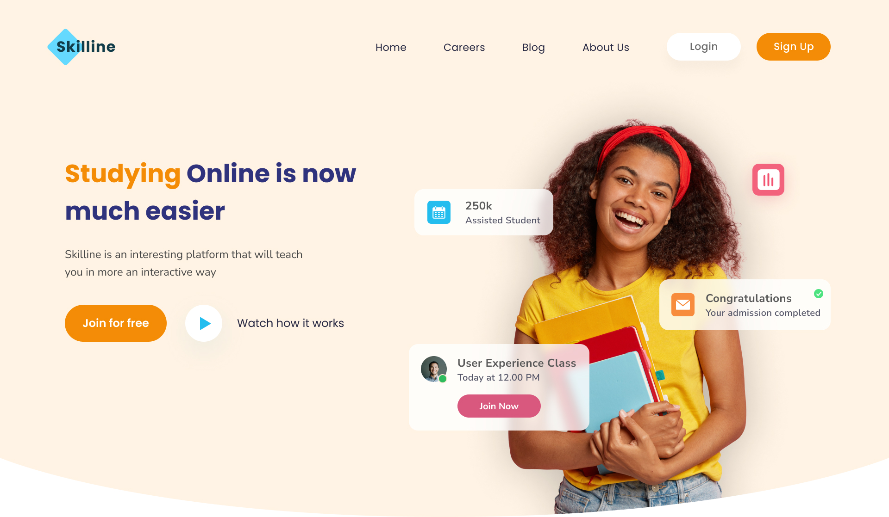

# Skilline Project

## About the Project

Skilline is a modern e-learning platform focused on improving online education experiences. It features responsive design, dynamic content management, and various animations that make learning more interactive and engaging.

## Features

- **Hover Effects**: Beautiful hover effects on key elements to improve user interaction and feedback.
- **Responsive Design**: Fully optimized for both desktop and mobile using Tailwind CSS.
- **Animations**: Smooth animations using AOS (Animate On Scroll) for better user engagement.

## Intro Section

The Intro section provides a brief overview of the platform with a floating animation. It captures the visitor's attention with Alpine.js handling interactivity.

## Everything Section

This section outlines the core functionalities of Skilline. Interactive buttons and hover effects, styled with custom CSS and Tailwind, enhance user experience.

## User Interface Section

The UI section demonstrates a clean and modern design for users to navigate through courses and lessons easily. Flicker animation is applied here for interactive buttons and elements, creating a dynamic feel.

## Tools Section

This section highlights the tools and technologies used for the project. Icons and tool names have hover effects for enhanced visibility.

## Test Section

The Test Section provides a space for users to take quizzes or assessments. With AOS animation, the section smoothly appears on scroll, adding to the dynamic nature of the platform.

## Management Section

The Management section helps instructors organize and manage their courses. It's fully responsive and designed using Tailwind CSS for easy scalability.

## Discussion Section

A forum-like feature for users and educators to interact, ask questions, and discuss topics. Alpine.js is used for managing real-time updates and conversations.

## Integration Section

Details about integrations with third-party APIs or tools such as payment gateways, learning management systems, and more.

## Testimonial Section

Customer and student testimonials are displayed here, with a floating animation to bring attention to the feedback provided by users.

## Blog Section

The Blog section provides updates, educational articles, and news related to the Skilline platform. Hover effects are applied for better navigation and readability.

## Footer Section

A fully responsive footer with links to social media, support, and contact information. Flicker animations are applied to social media icons for an engaging visual effect.

## Animations

- **Hover Effects**: Applied to buttons, images, and interactive elements to create a visually dynamic interface.
- **Floating Animation**: Certain sections like Intro and Testimonial have floating effects, created using custom CSS for smooth movement.
- **Flicker Animation**: Used for buttons and social media icons in the footer section, enhancing the interactive experience.

## Technologies Used

- **HTML**
- **Custom CSS**
- **Tailwind CSS**: For styling and responsive design.
- **Alpine.js**: For interactivity, managing real-time updates and UI interactions.
- **AOS (Animate On Scroll)**: For scroll-based animations, adding smooth transitions.
- **Custom CSS**: For unique animations like floating and flicker effects.

